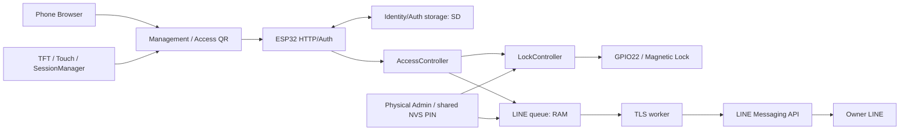

# SmartLock system understanding for Sol Lite

Date: 2026-09-28. Scope: architecture inspection only. No implementation or acceptance verdict.

## 1. Executive architecture summary

The production firmware is a local ESP32 access controller: TFT/touch creates short-lived capabilities; a phone browser supplies an identity credential; SD identity/status and credential verifiers decide authorization; LockController alone drives GPIO22 in the production target. A separately scheduled worker sends bounded, volatile notifications directly to LINE over verified TLS. LINE responses never become door commands.

**Primary historical context:** `C:\Users\fufu\Downloads\SmartLock_Project_Handoff_2026-09-28.md`, supplied by the user and read in full. File timestamp is 2026-09-28 04:31:23 local; this is metadata, not proof of the time each statement was observed. No copy was found in the workspace. The handoff describes an unfinished execution; source/history have since advanced. Its instructions are historical context, not authorization to start implementation during this inspection.

Evidence vocabulary: **SOURCE-VERIFIED** = inspected code, not execution; **GIT-VERIFIED** = repository history/diffs; **SOFTWARE-EVIDENCE** = saved earlier runtime output, not a fresh observation; **USER-PHYSICAL-CONFIRMATION** = earlier user confirmation recorded in the handoff/project reports, not reconfirmed here; **HANDOFF-DOCUMENTED** = stated by the supplied handoff; **LIVE-BOARD-UNKNOWN** applies to all current hardware/runtime state.

If a prior execution has no returned final result, its completion is unknown. Source, a report title, a tag, a binary, API acceptance and physical receipt are distinct evidence levels.

## 2. Repository/current Git state

- Repository: `C:\ESP\esp32_035_lock_touch_test`; branch `master`; inspected HEAD `8c15375781eab2f54e9d4f573c355ec2243a294b` (canonical recurrence evidence).
- Latest commit touching `src`, `lib` or `platformio.ini`: `979fc74405944e28375d92bdcb870b5aed1c1f6a`. No existing tracked diff in those paths. Subsequent HEAD history is documentation/evidence, not another firmware fix.
- Pre-existing modified tracked files: `docs/phase_reports/CANONICAL_RECURRENCE_INVESTIGATION.md`, `FINAL_FROM_ZERO_REPORT.md`, `STALE_ENROLLMENT_REPORT.md` (23 added / 1 removed lines total). The canonical report's final home-LAN follow-up is WIP, not committed HEAD evidence.
- Pre-existing untracked entries: `docs/phase_reports/{GOOGLE_SHEETS_HARDWARE_DEPLOYMENT_REPORT,H1_CANONICAL_HOST_DIAGNOSIS}.md`; `evidence/canonical_recurrence/{lan-environment,mdns-matrix-python312,mdns-matrix-python314}.json`; `evidence/final_from_zero/after-phone2.txt`; `evidence/google_h1/`; `evidence/line_v1/{otadata-live,partition-live}.bin`; `scripts/canonical_mdns_matrix.py`; `tools/canonical_recurrence/`. All preserved. Binary snapshots were not read.
- Existing `.pio/build/esp32_035/firmware.bin` is 1,238,000 bytes, timestamp 2026-09-28 04:32:04 local. This is artifact metadata only; no rebuild, hash-to-board comparison or new flash verification was performed.
- `LINE_WEB_ADMIN_DELIVERY_REPORT.md` records an earlier application-only deployment of `979fc74`, NVS comparison and runtime checks. Those historical claims are not evidence that today's running image still matches it.
- No applicable AGENTS.md was found in the workspace searches. This report is the only repository write by this run; no commit was created.

## 3. Hardware and GPIO map

SOURCE-VERIFIED: `platformio.ini`, `src/hardware/{LockController,DisplayManager,TouchManager}.*`, `src/storage/StorageHealth.cpp`, `src/main.cpp:272`.

| Component | Current configuration/ownership |
|---|---|
| Platform | Classic ESP32 / PlatformIO `esp32dev`, Arduino, `espressif32@6.12.0`; board product described as ESP32-035 |
| Display | ST7796, 320 x 480, portrait rotation 0; TFT_eSPI 2.5.43; QRCode 0.0.1 |
| TFT HSPI | MISO12, MOSI13, SCLK14, CS15, DC2; reset -1; 27 MHz writes / 16 MHz reads |
| Touch | TFT_eSPI resistive touch polling, CS33, shared HSPI at 2.5 MHz. XPT2046 and IRQ36 are hardware-baseline documentation; IRQ36 is unused by current polling code |
| microSD VSPI | SCLK18, MISO19, MOSI23, CS5; 4 MHz mount |
| Backlight | GPIO27, HIGH on / LOW off; DisplayManager |
| BOOT button | GPIO0 INPUT_PULLUP; short boot-held action requests recalibration; 5-second hold requests recovery; holding through reset can enter ROM loader |
| Magnetic lock | GPIO22: HIGH locked, LOW unlocked; LockController |

The intended MOSFET/magnet semantics are HIGH = energized = locked and LOW = de-energized = released. `docs/HARDWARE_BASELINE.md` records earlier human magnet/touch confirmation, not a measurement in this run. Firmware boot invokes `LockController::begin()` before Serial, display, storage or network: preload HIGH, output-enable, HIGH again. Firmware cannot guarantee the level before setup, through power loss, or correct external wiring.

**Complete production GPIO22 influence map:** direct writes are only `LockController.cpp` in `begin`, `lock`, `unlock`, `timerCallback`; `update` calls `lock`. Callers are `AccessController::request`; `main.cpp` startup, loop timeout, BOOT recovery, reset restart, physical Admin entry/reset/emergency; `FactoryResetController::performReset`; and `WebServerManager::ownerPinAuthorized` (reasserts locked). Diagnostics read the pin. No LINE worker writes it. Separate, non-production `reset_tool/src/main.cpp:38-40,69` directly writes GPIO22 HIGH; the absolute statement “only LockController in the whole repository” is false. That destructive utility was only searched, never executed/built.

## 4. Major firmware modules and ownership

| Module | Responsibility |
|---|---|
| `main.cpp`, `AppStateMachine`, `AppState` | Boot validation, main-loop orchestration, screen/session lifecycle, physical actions |
| `TouchManager`, `AdminTouchRouter`, `PhysicalAdmin`, `AdminDisplay`, `DisplayManager`, `QrManager` | Poll/debounce gestures, PIN menu and explicit confirmations, screen/backlight, QR rendering |
| `SessionManager` | Eight typed RAM slots; random capabilities, expiry, consumption and invalidation; retired enum types are not proof of active features |
| `AccessController` | Access QR + SD identity/status + verifier + interface-role checks before timed unlock |
| `EnrollmentManager`, `RegistrationRecovery`, `FirstOwnerSetup` | Management login, grants/revocation, authoritative recovery of uncertain browser registration, first Owner transaction |
| `IdentityStore`, `AuthStore`, `AtomicFileStore`, `StorageHealth` | SD authority, integrity, atomic file operations and mount health; old UserStore/DeviceStore retained for migration |
| `AdminPin`, `ConfigStore`, `NetworkSecrets`, `StaSecrets`, `InstallationMetadata` | Shared PIN authority and separate NVS responsibilities |
| `NetworkManager`, `CanonicalOrigin`, `CaptivePortal` | AP/STA transitions, stable hardware-derived hostname, mDNS, wildcard recovery DNS |
| `WebServerManager`, `WebAssets.h`, `lib/SmartLockWebServer` | Synchronous local HTTP/API, role gates, browser UI, bounded parser/response lifecycle |
| `LineNotifications`, `LineProtocol`, `TimeManager` | RAM queue, isolated outbound worker, bounded HTTP/JSON, TLS/time prerequisites |
| `Diagnostics`, `FactoryResetController` | Fixed read-only serial commands; separately gated destructive reset controller |

The actual main loop services lock timeout first, then network/mDNS/time/LINE state, captive DNS/HTTP, session expiry/diagnostics, and touch/Admin/UI. LINE network I/O runs on its own task, not via `LineNotifications::update`.

## 5. Lock safety architecture

SOURCE-VERIFIED: `AccessController.cpp:12-42`, `LockController.cpp:3-58`, `main.cpp:398-468`.

Access validates the typed unexpired QR, healthy configured state, valid duration, healthy identity database, matching credential, active status and allowed role/interface. It consumes the capability again using current time before unlocking. Already-unlocked requests consume the session without extending the existing pulse. A new pulse is refused if duration is invalid, already unlocked, or the relock timer cannot start.

`unlock` arms a one-shot `esp_timer` **before** driving LOW; its ESP_TIMER_TASK callback drives HIGH. Main-loop elapsed-time handling is a second relock path. This is a software timer dispatched on an ESP task, despite the log wording “hardware timer”; it is not an external independent safety circuit. Network stalls can delay main-loop UI, but need not delay the separate timer task. LINE failure never supplies authorization or cancels this timer.

Physical emergency unlock requires successful shared PIN verification, explicit menu confirmation, healthy SD/auth and `safeBootInitialized`. **Contradiction to an absolute network-independent local-authorization claim:** that boot flag includes `apStarted && canonicalReady && httpReady` and is latched at boot. Initial mDNS/AP/HTTP failure can deny later physical emergency unlock even with a valid PIN; later recovery does not recompute the flag. No ordinary runtime LINE readiness check guards unlock/relock.

Emitters run after successful unlock; wrong-PIN events run from the verification callback. They do not perform network I/O, but take queue/config mutexes using `portMAX_DELAY`. Thus “no network I/O on lock path” is verified; “strictly never blocks at all” is not. Worker critical sections appear short and do not span TLS calls. Shared heap, scheduler, timer task and mutex health remain common resources.

## 6. Identity/Owner/Admin authorization model

SOURCE-VERIFIED: `IdentityStore.cpp`, `AuthStore.cpp`, `EnrollmentManager.*`, `RegistrationRecovery.cpp`, `AccessController.cpp`, `WebServerManager.cpp:277-340`.

- SD `/smartlock/db/identities.rec` plus committed `identity-mode.rec` is the role/status/name authority; `/smartlock/db/auth.rec` schema 2 binds device IDs to salted credential verifiers. NVS configured flags alone and browser localStorage never authorize.
- Exactly one ACTIVE Owner, fixed ID `D000001`; at most 64 identity records. Unique IDs and names; names trim surrounding ASCII whitespace, validate UTF-8, max 40 bytes, compare exact bytes. This is not case-insensitive or Unicode-normalized uniqueness. Revoked records retain their names.
- Credential is a 32-byte browser-generated random bearer value, represented as 64 hex characters; SD stores salted SHA-256 verifiers, not plaintext. `addDevice` rejects reuse of a credential against every existing verifier. One verifier per ID; orphan verifiers can remain after interrupted enrollment, so total verifier count may exceed identities without granting authority.
- “1 DEVICE = 1 IDENTITY = 1 UNIQUE NAME = 1 CREDENTIAL” holds for logical enrollment records. There is no physical phone attestation: another browser profile/origin is another context, and a copied bearer credential can impersonate the same identity. Do not equate a browser record to an uncloneable handset.

| Role | Door Access on home LAN | Management | Grants/revocation |
|---|---|---|---|
| Owner | Yes | LAN or protected recovery AP; Owner-only sensitive operations | Admin/User/Guest; cannot revoke Owner |
| Admin | Yes | Home LAN, restricted by endpoint/role | User/Guest only |
| User / Guest | Yes, while active | No | None |

Recovery AP Access is Owner-only. Guest has no automatic account-expiry rule in inspected Access logic. Management is not universally Owner-only: LINE/PIN sensitive functions are; general Management supports Admin on LAN.

Management QR is 90 seconds; successful login consumes it and creates a 300-second ManagementAuth capability tied to the active issuer ID. Only one slot/token is current. Enrollment is LAN-only, 120 seconds, bound to pending name/role/issuer; issuer activity and grant authority are rechecked on completion. Capability is consumed before auth/identity writes. Revocation changes authoritative status and is checked again on access/management authorization; it does not need to erase the browser secret.

Browser stale-state recovery asks `/api/enroll/credential-status` with a valid invitation. ACTIVE blocks duplicate registration; REVOKED/UNKNOWN permit the appropriate new-enrollment flow. Stored browser credential replacement follows authoritative success/reconciliation, not an assumption based on localStorage presence.

## 7. Admin PIN architecture

SOURCE-VERIFIED: `AdminPin.cpp`, `FirstOwnerSetup.cpp`, `PhysicalAdmin.cpp`, `WebServerManager.cpp:424-529,805-831`, `main.cpp:337-387`.

One NVS `sl-pin` verifier is shared by physical Admin, Owner web PIN change and LINE maintenance arming. Derivation uses salted PBKDF2-HMAC-SHA256 with 10,000 iterations; actual PIN/verifier/salt values were not read from device storage and are not reproduced here.

Completed valid-format comparisons increment a durable failure count; success resets it. Three failures cause a 60-second lockout. The failure count survives reboot; the lockout start is RAM and is set to boot time on begin, so reboot with a locked count starts another full wait. Invalid format, unavailable storage and already-locked attempts do not become completed wrong comparisons. The callback emits a notification for each mismatch, including the threshold-reaching attempt, before the counter persistence result is known. Web PIN operations additionally allow at most three gated attempts per minute.

Change requires Owner Management, locked state, no connecting STA transaction, current PIN and matching valid new/confirmation fields. Success saves/read-verifies the verifier, clears failures and increments RAM revision; LINE maintenance nonce is invalidated. Physical Admin verification grants a short-lived local menu session; Emergency and Reset require further explicit actions.

Existing correctly sized verifier is not overwritten by `begin`; a missing verifier with `configured=true`, or malformed existing verifier, fails closed. Initial temporary default is created only in the `!present && !configured` branch; Setup replaces it through `initialize`, then clears its initial marker. No existing PIN value is printed here.

**Important integration caveat:** caller passes the derived `configured` value, which becomes false for SD/migration/AP-secret validation failure, not only for a genuinely new installation. If the PIN record is also missing, the default-creation branch can run on an installation whose NVS already claims configured. This does not overwrite a valid existing verifier and does not itself unlock, but the claim “default creation only on genuinely new device” is not fully guaranteed across fault combinations. Sol must review this before claiming the invariant universally.

## 8. Network/AP/STA/mDNS/origin architecture

SOURCE-VERIFIED: `NetworkManager.cpp`, `CanonicalOrigin.cpp`, `CaptivePortal.cpp`, `main.cpp:159-201,350-367`, `WebServerManager::homeLanRequest`.

New-device setup AP is intentionally open; configured AP uses the saved 32-character generated password. Saved STA starts in AP+STA, with SDK credential persistence disabled. Candidate credentials remain RAM until observed disconnect/reconnect and nonzero address; only `StaSecrets::saveConfirmed` commits them. Failures retry saved STA on minute cadence. Recovery reuses the saved password and changes the AP SSID; no new Owner or credential is created.

Home Wi-Fi is the production primary path. A request arriving on the STA local socket marks LAN reachability; after a grace period, no AP clients and no active fallback lease, AP can turn off. Fresh Access/Management screens request a five-minute recovery lease. BOOT long-hold can request recovery without reset. Weak RSSI is an observation, not an explicit threshold in this AP-off policy.

Canonical label is `smartlock-` plus the full 48-bit `ESP.getEfuseMac()` representation; `.local` appended. For the historically observed board it is `http://smartlock-04225a0ff0a4.local`. This is hardware-derived, not a DHCP address or the random installation ID. mDNS advertises HTTP port 80. Current update retains a started responder, relying on IDF interface handling; it retries failed initialization, not actual end-to-end resolver health.

Access QR uses `/a/<session>`; Management uses `/manage?session=...`; enrollment uses `/enroll?session=...`, all on canonical host. Numeric DHCP addresses are diagnostic locations, not permanent identity origins. Browser localStorage is scoped by scheme/hostname/port and profile; opening an IP or a different scheme/profile cannot see the canonical origin's Owner record. Firmware does not automatically migrate that authority across origins.

CaptivePortal wildcard UDP53 returns the AP address. A home-LAN phone does not gain that DNS route just because AP is enabled. `buildFallbackWifiQr` remains, but `870ec7f` removed the active TFT join-QR presentation/touch path. Associated-client recovery acceptance therefore remains separate from AP existence.

Historical canonical recurrence evidence shows working direct unicast mDNS and numeric HTTP but failing Windows canonical lookup/multicast probes. It does not identify Android's resolver path, multicast fault location or a firmware regression. No browser, network or board probe was run here.

## 9. Storage ownership map: SD / NVS / RAM / browser

| Store | Contents and ownership |
|---|---|
| SD authority | `identities.rec`, committed `identity-mode.rec`, `auth.rec`; IdentityStore/AuthStore |
| SD retained history | Legacy users/devices and `backups/identity-v1`; old logs/outbox/export artifacts; not current authorization fallback or active notification queue |
| NVS `sl-config` | CRC/generation slots `cfg-a/cfg-b`, configured/Owner flags, duration and product settings; corrupt present slot fails closed |
| NVS `sl-pin` | Shared PIN verifier, failure count, initialization marker |
| NVS `sl-net` / `sl-sta` | Protected AP password record / confirmed STA credential slots |
| NVS `lock-touch-v2` | Five calibration values in `cal`; normal boot loads them |
| NVS `sl-install` | Installation identifier, generated only when configured and missing; distinct from canonical hostname |
| NVS `sl-line` | Versioned LINE label/token/recipient/public Basic ID/timezone/enabled state; verified inactive `cfg0/cfg1` slot then `active` selector; v1 compatibility migration exists |
| Retired namespaces | `sl-generation` active/transaction keys explicitly cause unsupported-store failure; retired cloud/audit/OTA names still occur in gated reset cleanup, not active services |
| RAM firmware | Sessions, pending enrollment, Management token, physical Admin authorization, timer state, PIN revision/lockout timing, network candidates, LINE config cache/queue/counters/retry/quota state |
| localStorage | `smartlock.devices.v1` credential record; `smartlock.setup.v1` Owner credential and AP join data; setup/enrollment pending and enrollment pending-recovery records |
| sessionStorage | No active use found in production source. Management token and maintenance nonce are browser JS memory, not durable sessionStorage |

`AtomicFileStore` uses CRC-framed current/temp/backup files and readback before rename. Normal auth reads require CurrentValid; BackupOnly is not accepted as authority, preventing resurrection of old revocations. Storage is single-loop owned; static scratch is not suitable for concurrent web mutation without redesign.

Configured boot still calls explicit legacy identity migration when no new-model artifacts exist; committed mode returns health only, partial artifacts fail closed. No migration ran during this inspection. Operational event-history writers are absent from production; archived EventLog/Audit are under tests/archive. `systemDiagnostic` only reads a bounded old outbox digest and reports writes DISABLED. Earlier saved evidence shows 23 inert files / 18,945 bytes; that is not a current SD inventory.

## 10. LINE notification architecture

SOURCE-VERIFIED: `LineNotifications.cpp`, `LineProtocol.h`, hooks in AccessController/AdminPin/main, and Owner HTTP handlers.

Production path is ESP32 -> HTTPS `api.line.me` -> Messaging API -> configured Owner recipient. No active Google Sheets, Apps Script, Worker/D1, PostgreSQL, application relay/backend, inbound LINE webhook or cloud door control was found. **Qualifier:** `TimeManager.cpp:20` actively lists `time.cloudflare.com` alongside `pool.ntp.org` for SNTP; “no Cloudflare of any kind” would be inaccurate. Time/DNS/Internet remain outbound notification dependencies.

Events: UNLOCK_SUCCESS is emitted after AccessController's successful lock call; ADMIN_PIN_FAILED comes from the shared verifier mismatch callback; ADMIN_EMERGENCY_UNLOCK follows successful physically authorized unlock in main. Generation counters increment even when LINE is disabled; generated is not enqueued.

Queue is static RAM, capacity 16 including in-flight work, one-hour TTL. Saturation drops oldest waiting event (or rejects when no waiting slot is available); failed count records loss. Reboot loses queue, retry/quota state and counters. No durable delivery or audit-log guarantee exists. Each event has a random retry key. A single FreeRTOS worker is pinned to core 0, priority 1, stack allocation 24,576 bytes. Queue/config mutexes are separate; network operations use a snapshot outside locks.

HANDOFF-DOCUMENTED section 6 explicitly accepts RAM queue loss on reboot. Section 13 requires worker priority lower than local auth/Admin/recovery/Management work. The installed Arduino framework `C:\Users\fufu\.platformio\packages\framework-arduinoespressif32\cores\esp32\main.cpp:71` creates loopTask at priority 1 too. These local operations run within loopTask; separate-core scheduling does not establish a strictly lower priority. This is a source/configuration discrepancy, not a measured scheduling failure or proof of the flashed framework.

Worker requires configured/enabled, STA, synchronized time, no auth block, free heap >=90,000 and largest MALLOC_CAP_8BIT block >=40,000 bytes. SNTP freshness is 24 hours. Quota/consumption must be known and available before taking a push; code accepts a limited quota up to 300, which is a source policy, not a claim about today's LINE plans. Quota refresh is 15 minutes normally, six hours when full, 30 seconds after failure.

DNS has a three-second bounded wait; TLS uses a compiled root CA, SNI/hostname checking, five-second handshake setting and a 12-second overall request deadline checked by transport code. It does not use an insecure certificate bypass. HTTP POST sends bounded JSON to `/v2/bot/message/push`, bearer auth, content length, close and retry-key headers. Header budget is 2,048 bytes, response body 2,048 bytes, with structural UTF-8/JSON validation and constrained length/chunk parsing.

Completed valid 200 or 409 with validated accepted-request-ID retires successful work. 401/403 blocks further authenticated traffic pending configuration change; 429 refreshes quota and backs off or holds quota-rejected work until expiry; other 4xx are terminal. Transport/5xx retries use 5/15/30/60/120/300-second backoff plus jitter, maximum 20 actual attempts and TTL. Failed admission does not consume a send attempt. Config generation change invalidates old in-flight work. API success is not phone receipt.

Current LINE provisioning is Owner Management + shared PIN -> one-use 120-second RAM nonce bound to Owner session/PIN revision/locked state -> separate developer commit POST -> verified NVS write. Normal UI exposes label, status, test, disconnect and public Add Friend, not raw token/recipient input. Physical USB provisioning and its parser/helper were removed in `979fc74`. Cancel, replacement login, expiry, PIN revision, unlock and disconnect invalidate relevant maintenance state. Commit consumes valid capability before secret parsing/write.

## 11. Security boundaries

- QR is a time-bound capability, not a substitute for an identity credential. Server revalidates role/status; browser strings are untrusted.
- Owner-only PIN/LINE handlers are stricter than general Admin Management. Recovery AP is Owner-only; enrollment requires STA interface, identified by socket local address rather than a client-supplied role claim.
- Local HTTP is plain port 80. Outbound LINE TLS does not encrypt browser PIN/credential/provisioning requests. LAN integrity/confidentiality and browser-origin integrity remain material trust assumptions.
- PIN verifier data and credential verifiers stay out of normal API/diagnostics. LINE config is secret-bearing NVS and RAM; buffers are wiped where implemented, but no physical flash encryption guarantee was established by this inspection.
- Serial production commands are fixed DIAG_AUTH/DIAG_SYSTEM, not a write/unlock/provisioning backdoor. DIAG_AUTH reveals identity metadata, so it is read-only rather than privacy-neutral.
- Gated FactoryResetController is destructive; its existence is not permission to invoke it. The separate reset_tool is outside production authority flow and must not be used as a workaround.

## 12. Persistent state that must be preserved

| Preserve | Future-work boundary |
|---|---|
| Existing Owner / identities / revocations / verifiers | Keep SD authority files, mode marker and schema; never reconstruct from backups or re-enroll to fix networking |
| Admin PIN | Preserve `sl-pin`; do not reinterpret a health failure as a new installation; never initialize an existing valid PIN |
| Wi-Fi / protected fallback | Preserve `sl-net`, `sl-sta`, password reuse and confirmed-only persistence; do not replace credentials for diagnostics |
| Calibration | Preserve `lock-touch-v2/cal`; no forced recalibration or NVS erase |
| Canonical hostname | Preserve full hardware-ID algorithm and HTTP origin; no numeric-IP production QR or speculative browser storage migration |
| LINE configuration | Preserve active slot and schema; no save/disconnect/reprovision operation during diagnosis; account for v1 compatibility before future boot |
| Installation / configuration | Preserve `sl-install` and generation/CRC config slots; missing metadata can trigger writes on boot |
| Lock behavior | Preserve early HIGH, sole production writer, timer-before-LOW, duration checks and relock paths |
| Access / Management | Preserve typed one-use QR, server status/verifier gates, interface restrictions and Owner-only sensitive operations |
| Inert history | Keep old files inert; neither resume writers nor delete them as cleanup |

Firmware-only work is not automatically state-neutral: erase-flash, partition changes, reset_tool, schema migration, new defaults, missing-record initializers, first-setup repair and reset handlers can mutate state. Ordinary valid existing-state boot loads PIN/calibration/credentials, but exceptional/migration paths must be assessed before any later deployment.

## 13. Relevant Git evolution

GIT-VERIFIED via log, tag targets, change lists and selected source diffs; tags are historical anchors, not live-board labels.

| Point | Actual meaning |
|---|---|
| `4439bdb`, `google-sheets-archive-before-removal` | Google checkpoint before removal |
| `b6db664` | Removes active cloud/Google firmware, receiver and test integration; retains marked historical docs |
| `064518a`, `line-notifications-v1` | Adds RAM LINE worker/hooks/protocol/diagnostics; moves event-history classes out of production |
| `3fc128d`, `line-owner-provisioning-v2` | Historical Owner-gated USB provisioning; removes web credential entry |
| `48c653e`, `line-owner-provisioning-v2-physical` | Historical physical Admin authorization for scoped USB provisioning |
| `14645a9` | Isolated TLS worker stack increase |
| `f750bf8`, `line-owner-provisioning-v2-tls` | TLS/provisioning evidence checkpoint; this tag does NOT point at c5106ac |
| `8df5c8e` then `c5106ac` | API acceptance report, then user receipt confirmation; c5106ac changes one document, no firmware |
| `2b4fcf2` | Introduces protected same-origin fallback architecture |
| `c229d41` | Retains mDNS responder, adds TXT refresh and disables modem sleep; not the initial fallback implementation |
| `870ec7f` | Separate LINE Add Friend page, removes active TFT fallback QR UI; transport unchanged |
| `979fc74` | Owner+PIN web maintenance, physical USB removal, shared PIN initialization changes, HTTP allocation release, TXT mutation removal and pipeline counters |
| `ae25d30` | Saved web-maintenance deployment/preservation evidence |
| `8c15375` | Canonical recurrence evidence; no new firmware remediation |

## 14. Current unresolved LINE/TLS/heap problem

HANDOFF-DOCUMENTED sections 10-13 describe an unfinished execution with four queued events, no sends and about 34 KB contiguous heap, versus a 40 KB guard. This is credible for its historical snapshot, not sufficient as today's diagnosis. `LINE_WEB_ADMIN_DELIVERY_REPORT.md` records four queued events, zero successful sends and largest block 34,804 before `979fc74`; guard is 40,000. Current source already contains the HTTP cleanup patch; do not implement it again as though missing. The Git commit and saved later reports establish source/history advancement, not that the user returned final completion/acceptance of the handoff's execution.

Saved post-flash evidence has largest block 55,284, zero heap blocks and two TLS connections/responses, but zero pushes. Later recurrence report records two earlier user-received events and then a reboot. Its saved `evidence/canonical_recurrence/final-runtime.txt` has free 112,140, minimum 48,056, largest 55,284; TLS/responses 36/36, heapBlocked 3, zero generated/enqueued/push/sent counters and queue zero, state ServiceError. This shows intermittent admission denial and later TLS activity during that boot, not a current stuck event queue. Counters reset on reboot; quota requests also increment TLS/response counters.

| Requested diagnostic stage | Actual instrumentation / limitation |
|---|---|
| EVENT GENERATED | unlock/pin/emergency atomic counters; includes disabled LINE |
| ENQUEUED | enqueued counter; queued includes in-flight; dropped/expired work contributes failed |
| SEND ATTEMPT STARTED | pushStarted inside lineRequest for pushes only, after worker admission/quota checks |
| TLS ADMITTED | heapAdmitted snapshots + heapBlocked; no separate admitted counter, no per-denial retained record; snapshot overwritten by later checks |
| HTTP REQUEST SENT | pushWritten after complete header/body write; not server acceptance |
| LINE API RESPONSE | responses increments after valid status line, before full body validation; includes quota calls; lastPushHttp is push-only |
| QUEUE RETIRED / RETAINED | sent/failed/queue/testState; no per-event durable retirement trace or reason counters |

Thus the conceptual pipeline is not a literal counter order: heap admission happens before pushStarted, and successful DNS/TLS can occur only for quota work. `tlsMinimum` is the global heap low-water mark sampled at request exit, not an isolated TLS-only minimum. Good current heap does not disprove earlier transient denial. ServiceError can persist until a later quota/event state update; that is source-supported possibility, not proven incident cause.

Resource owners for Sol: static queue/config caches and 24-KB task stack; worker text[1025], body[2048], request header[1200], line[256], response[2049] nested stack buffers; WiFiClientSecure/lwIP DNS/TLS heap; mDNS and Wi-Fi task allocations/scans; repeated SD identity row allocations plus 8-KB payload; AuthStore and AtomicFileStore static 8-KB scratch arrays; HTTP String arguments/headers/URI/responses and bounded body malloc; generated enrollment QR SVG/JSON Strings. Text/JSON buffers inside worker are primarily stack, not all separate heap blocks.

`979fc74` deletes request argument arrays and releases header/URI/response String capacities when connection handling retires, beyond earlier value wiping. It also removes TXT mutation. Those changes do not prove no allocation remains during an active/closing request; concurrent request/TLS allocations can still matter. No heap trace or worst-case task stack margin was measured here. No guard, constant, buffer or task was changed.

## 15. Known facts vs assumptions vs live-board unknowns

- SOURCE/GIT-VERIFIED: module ownership, compiled configuration, current guards and roles, commit/tag distinctions, existing tracked source matching HEAD.
- SOFTWARE-EVIDENCE: earlier build/deployment reports and selected saved diagnostic text; the latest saved sample above was inspected directly. No current board connection, HTTP probe, private NVS read or test was performed.
- USER-PHYSICAL-CONFIRMATION (historical, recorded): phase-0 magnet polarity/touch behavior; earlier stale-browser enrollment/unlock/relock; c5106ac test-message receipt; recurrence report's later receipt account. Handoff section 4 also records Access/Management working after fallback, without proving which network path the phone used. This run did not receive new physical results. No full current regression PASS follows from those isolated confirmations.
- LIVE-BOARD-UNKNOWN: running image/boot slot, current identities/status, exact PIN/secret preservation, actual magnet holding/release, current LINE delivery, Owner Android canonical-origin behavior and AP association.
- Not established: multicast failure location; causal relationship of TXT removal to discovery; exact allocation responsible for three transient heap denials; completion of any prior unreturned execution.

**Source/handoff contradictions/discrepancies: 7**, counting temporal state and attribution mismatches separately from unmet invariants:

| ID | Handoff claim | Inspected reconciliation |
|---|---|---|
| C1 | Sections 10-11: current implementation is WIP, no final commit, approximately nine changed files | GIT/SOURCE: 979fc74 commits the relevant changes; current tracked firmware has no diff. This does not establish returned execution results, current deployment or final acceptance |
| C2 | Sections 10/12/13: latest sender is stopped before TLS at about 34 KB with four queued events | SOFTWARE-EVIDENCE: later saved boot has TLS/responses 36/36, queue zero, three transient heap blocks and ServiceError. Original incident is not disproved; “latest” is stale relative to repository evidence |
| C3 | Section 8 groups c5106ac as v2/TLS work with the TLS tag | GIT: c5106ac only appends receipt acceptance; TLS tag points to f750bf8, firmware stack change to 14645a9 |
| C4 | Sections 4/8 attribute fallback introduction to c229d41 | GIT: 2b4fcf2 introduces fallback; c229d41 modifies responder lifecycle and modem sleep |
| C5 | Sections 3/11: default PIN applies only to a genuinely new device | SOURCE: existing valid PIN is preserved, but derived configured=false plus missing PIN can enter initialization on an old unhealthy installation; see section 7 |
| C6 | Section 2: LINE/network failure must not affect unlock/relock | SOURCE: relock is independent of LINE, but initial network-service failures can deny physical emergency unlock through safeBootInitialized |
| C7 | Section 13: LINE task priority must be lower than local auth/Admin/recovery/Management | SOURCE/local SDK: worker and loopTask are both priority 1; different cores are not a strict priority ordering |

Additional scope qualifications are not counted as contradictions: no Cloudflare relay is compatible with Cloudflare NTP; production-only GPIO ownership excludes the separate reset utility; hardware IRQ36 exists in documentation but current touch is polled; logical browser identity is not physical handset attestation. The phase-0 centered-toggle/no-QR-library statements in HARDWARE_BASELINE are historical, not present production behavior. Handoff's free-plan quota is historical; no current price/plan verification was needed for this source audit.

The eight risks below are review findings, not eight proven production failures.

## 16. Potential architectural risks requiring Sol review

1. **Local emergency availability depends on network bootstrap.** `safeBootInitialized` includes initial AP/mDNS/HTTP success. Concrete mismatch with an absolute network-independent local authorization requirement; relock itself remains separately timed.
2. **New-installation/PIN bootstrap state conflation.** Derived configured=false can reflect storage/secret failure, so a simultaneously missing PIN can be initialized on an old installation. Existing valid PIN is preserved; fault-path invariant needs review.
3. **Bearer identity and plain local HTTP trust.** Logical browser identity is cloneable; local HTTP carries credentials/PIN and the developer LINE secret POST. Outbound TLS does not cover this boundary. Sol must explicitly own the accepted threat model, without an unrequested redesign here.
4. **Shared heap and incomplete incident telemetry.** Admission is a snapshot, not a reservation against simultaneous HTTP/SD/mDNS allocations; overwritten samples and mixed quota/push counters cannot attribute a denial. Old fix is already present; causal diagnosis remains open.
5. **Canonical-origin recovery availability gap.** mDNS initialized is not phone resolution; removed TFT join UI means a running protected AP is not sufficient user recovery. No current Android home-LAN or associated-AP acceptance is established.
6. **Emitter mutex waits weaken a literal nonblocking claim.** Main-loop event callbacks use indefinite mutex waits. No network operation was found inside worker critical sections and no deadlock is proven, but strict latency independence requires bounded evidence/review.
7. **Software HIGH/relock is not a physical startup/power guarantee.** Pre-setup GPIO, wiring, magnet power and scheduler/timer health are outside the verified guarantee. Preserve the existing controller and require physical acceptance before extending safety claims.
8. **Priority requirement differs from configured tasks.** Worker priority 1 equals local framework loopTask priority 1; auth/Admin/recovery have no separate higher-priority task here. Sol should resolve the requirement/evidence mismatch without treating core separation as proof or tuning scheduler constants in advance.

## 17. Recommended bounded next investigation for Sol Lite

Sol Lite takes lead; Astra stops after this report. Permanent workflow from the user's request: normal `Sol Lite -> Luna High -> Sol Lite Review`; major design `Astra Lite -> Sol Lite -> Luna High -> Sol Lite Review`. Luna may implement/collect evidence only after Sol scopes it; Luna cannot approve security/storage/protocol/TLS or final acceptance.

The exact handoff is now reconciled in this report. First obtain any still-unreturned previous execution result and review the later `LINE_WEB_ADMIN_DELIVERY_REPORT.md` and `CANONICAL_RECURRENCE_INVESTIGATION.md` against `979fc74` source and `8c15375` evidence. Do not assume earlier pending work completed merely because source was committed. Keep the eight architectural findings separate from the active incident.

For incident diagnosis, Sol should authorize one bounded, non-mutating snapshot using existing diagnostics with a known observation window and source/build/live provenance. Distinguish quota traffic from pushes, record counter deltas and free/largest/min heap, and correlate with the actual registered Owner browser's home-LAN canonical path. Existing saved evidence makes multicast/Android resolution a separate open issue; numeric HTTP must not substitute for canonical Access/Management acceptance. A packet-capture proposal needs its own reviewed scope; the previously rejected draft is not permission to run it.

Only if a fresh delivery test is still needed should Sol coordinate one user-driven authorized event and separate generation/enqueue/write/API evidence from phone receipt and physical relock. Do not generate wrong PIN attempts, unlocks, test pushes or configuration changes just to collect a baseline. Do not lower 90,000/40,000 guards, reinstate TXT mutation, restart mDNS speculatively, clear browser storage, re-enroll Owner or re-provision LINE. Any later patch requires a concrete causal finding and Sol's bounded implementation task/review; no patch is proposed by this run.

## 18. Explicit list of things Astra did NOT change

No firmware/source/config/library/test edits; no build or test execution; no flash/deployment, serial connection or board reboot; no Factory Reset, erase_flash, NVS erase/readout, SD format/migration/deletion, partition or eFuse operation; no credentials/PIN/Owner/Wi-Fi/LINE replacement; no browser storage/network changes; no threshold tuning or bug fix; no destructive Git command, checkout/reset/rebase/cherry-pick/commit; no Luna or other subagent invocation. Existing WIP was preserved. Only this architecture report was created.
